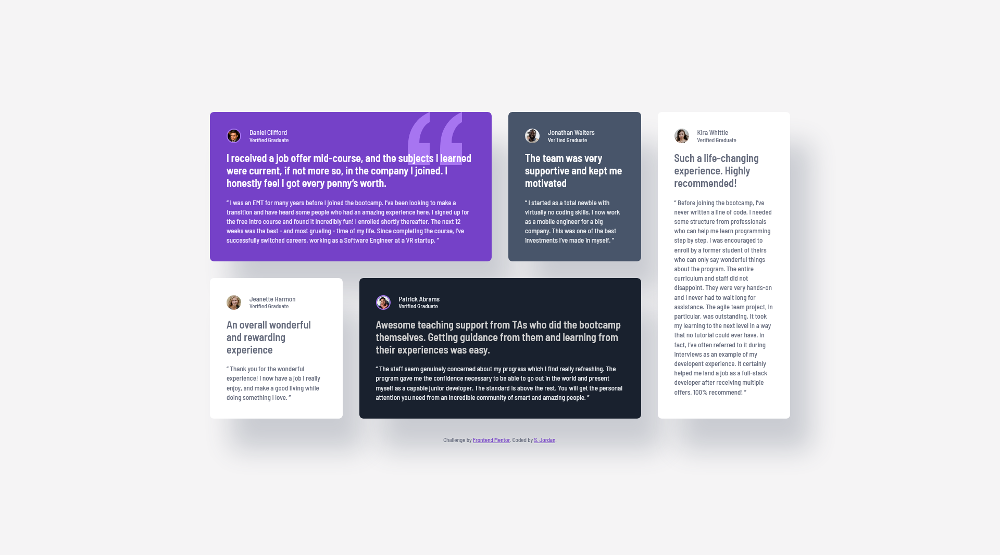

# Frontend Mentor - Testimonials grid section solution

This is a solution to the [Testimonials grid section challenge on Frontend Mentor](https://www.frontendmentor.io/challenges/testimonials-grid-section-Nnw6J7Un7). Frontend Mentor challenges help you improve your coding skills by building realistic projects. 

## Table of contents

- [Overview](#overview)
  - [The challenge](#the-challenge)
  - [Screenshot](#screenshot)
  - [Links](#links)
- [My process](#my-process)
  - [Built with](#built-with)
  - [What I learned](#what-i-learned)
  - [Useful resources](#useful-resources)
- [Author](#author)

**Note: Delete this note and update the table of contents based on what sections you keep.**

## Overview

### The challenge

Users should be able to:

- View the optimal layout for the site depending on their device's screen size

### Screenshot

### Links

- Solution URL: [Solution on Frontend Mentor](https://www.frontendmentor.io/solutions/testimonials-grid-9I5xikpDuV)
- Live Site URL: [GitHub Pages](https://curricle.github.io/Testimonials-Grid/)

## My process

### Built with

- Semantic HTML5 markup
- CSS custom properties
- Flexbox
- CSS Grid

### What I learned

I brushed up on how to assign grid items to specific positions without just using grid-template-areas.

### Useful resources

- [CSS Grid Guide on CSS Tricks](https://css-tricks.com/snippets/css/complete-guide-grid/) - Handy cheat sheet reference for CSS grid features and syntax.

## Author

- Website - [Steph Jordan](https://jordanmakes.com)
- Frontend Mentor - [@curricle](https://www.frontendmentor.io/profile/curricle)
